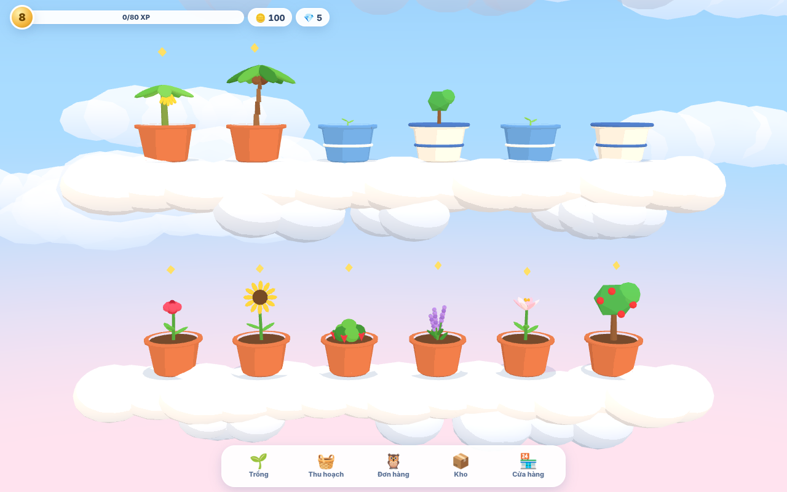

# Skyline Garden

[](https://github.com/minh-le1710/Skyline-Garden/actions/workflows/ci.yml)

Game nông trại trên mây, đồ họa 3D low-poly, chạy trên trình duyệt (ưu tiên điện thoại), làm bằng [three.js](https://threejs.org/).
Lối chơi lấy cảm hứng từ thể loại "khu vườn trên mây": trồng cây trong chậu trên các tầng mây, thu hoạch, giao đơn hàng cho Cú, lên cấp, mở thêm tầng.
Toàn bộ tên gọi, hình ảnh và mô hình trong game là tài nguyên riêng của dự án.



## Cách chơi

- **Trồng:** bấm 🌱 Trồng, chọn hạt giống rồi kéo ngón tay (hoặc chuột) qua nhiều chậu liền một lượt.
- **Thu hoạch:** cây chín có ngôi sao nhỏ lấp lánh. Chạm vào cây, hoặc bấm 🧺 Thu hoạch rồi kéo qua cả hàng.
- **Chạm vào chậu đang lớn** để xem thời gian còn lại, hoặc dùng ruby để cây chín ngay.
- **Đơn hàng Cú 🦉:** giao đủ nông sản để nhận vàng và XP, lời hơn bán thẳng cho cửa hàng.
- **Kho 📦:** bán nông sản. Kho có sức chứa giới hạn, mở rộng ở Cửa hàng.
- **Cửa hàng 🏪:** mua hạt giống, chậu (chậu gốm cộng XP, chậu sứ giúp cây lớn nhanh hơn) và mở rộng kho.
- **Mở tầng mới:** chạm vào tầng mây mờ phía trên khi đủ cấp và vàng. Vuốt lên xuống để cuộn qua các tầng.
- Cây vẫn lớn và đơn hàng vẫn tới khi bạn tắt game. Game tự lưu trong trình duyệt.

## Chạy thử

```bash
npm install
npm run dev          # mở http://localhost:5173 (dùng --host để thử trên điện thoại cùng mạng)
```

Thêm `?debug` vào URL để bật công cụ debug trong console: `__skyline.skip(60)` tua nhanh 60 giây, `__skyline.addGold(1000)`, `__skyline.setLevel(5)`, `__skyline.reset()`.

Lần đầu chạy `npm run e2e` trên máy mới cần cài Chromium cho Playwright: `npx playwright install chromium`.

## Lệnh

| Lệnh                | Việc                                      |
| ------------------- | ----------------------------------------- |
| `npm run dev`       | Server phát triển (Vite)                  |
| `npm run build`     | Kiểm tra kiểu + build ra `dist/`          |
| `npm run typecheck` | Chỉ kiểm tra TypeScript                   |
| `npm run lint`      | ESLint                                    |
| `npm test`          | Unit test logic game (Vitest)             |
| `npm run e2e`       | Test chơi thật trên Chromium (Playwright) |

## Cấu trúc

```
src/game/    Logic game thuần (không phụ thuộc three.js hay UI): state, action, đơn hàng, cấp độ, lưu game
src/core/    Nối logic với render và UI: Game, EventBus, vòng lặp
src/render/  Cảnh 3D: trời, tầng mây, chậu, cây, hiệu ứng
src/input/   Cuộn camera, chọn ô, kéo công cụ qua nhiều chậu
src/ui/      Giao diện Preact phủ lên canvas
src/i18n/    Chuỗi hiển thị (mặc định tiếng Việt)
tests/       Unit test (Vitest)
e2e/         Test end-to-end (Playwright)
```

Logic game là các hàm thuần `(state, ...args, now) → { state mới, events } | lỗi`. Thời gian lớn của cây tính theo timestamp nên cây vẫn lớn khi tắt game. Sau này có thể dùng lại logic này trên server.

## Đăng lên GitHub Pages

Workflow `.github/workflows/pages.yml` tự đăng bản web mỗi khi CI xanh trên nhánh `main`. Bật một lần:

1. Tạo nhánh `main` (vd. merge nhánh phát triển vào) và đặt làm nhánh mặc định: **Settings → General → Default branch**.
2. **Settings → Pages → Build and deployment → Source: GitHub Actions**.
3. **Actions → Pages → Run workflow** để đăng lần đầu. Game sẽ có ở `https://minh-le1710.github.io/Skyline-Garden/`.

(Repo riêng tư cần gói GitHub trả phí mới dùng được Pages.)

Thiết kế chi tiết các mốc nằm trong [`docs/design/`](docs/design/README.md).

## Lộ trình

- **M1 (hiện tại):** vòng chơi cốt lõi offline: tầng mây, chậu, trồng/thu hoạch, kho, cửa hàng, cấp độ, đơn hàng Cú, lưu game.
- **M2:** máy chế biến, thuộc tính chậu + lò đúc chậu, sâu bọ, khinh khí cầu, nhiệm vụ ngày.
- **M3:** mỏ, thú cưng đồng hành, âm thanh tổng hợp bằng Web Audio, hướng dẫn, thành tựu, PWA.
- **M4:** backend (tài khoản, lưu cloud, bạn bè, sạp hàng, bảng xếp hạng).
- **M5:** đóng gói Android/iOS bằng Capacitor.
